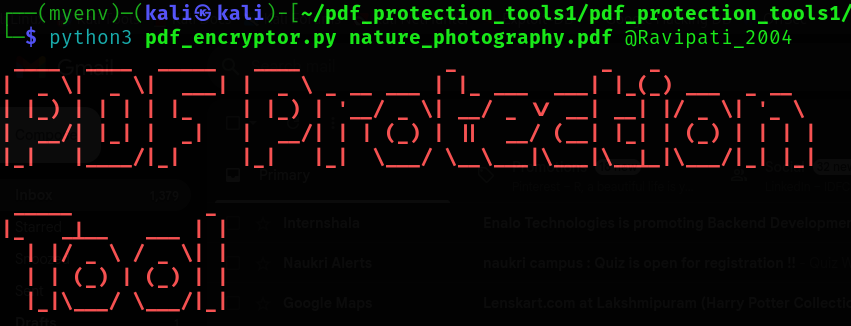

# encrypt_pdf
This Python script encrypts PDF files using a password provided via the command line. It reads the original file, applies encryption using PyPDF2, and safely replaces the original with the encrypted version. Useful for securing sensitive PDF documents.

# if it won't work make try to use in virtual environment .

# Creating  a virtrul environmaent as follow:

