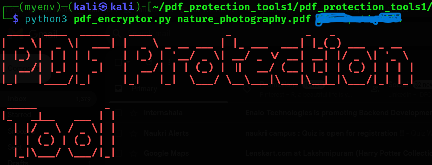

# encrypt_pdf
This Python script encrypts PDF files using a password provided via the command line. It reads the original file, applies encryption using PyPDF2, and safely replaces the original with the encrypted version. Useful for securing sensitive PDF documents.

# if it won't work make try to use in virtual environment .

# Creating  a virtrul environmaent as follow:

The PDF Encryption Tool is a Python-based utility designed to help users securely encrypt and decrypt PDF files with ease. Built using the PyPDF2 library, this tool enables users to protect sensitive documents by applying password-based encryption. It supports both encryption and decryption operations via a simple command-line interface. To encrypt a PDF, users simply provide the input file and a desired password, and the tool will generate a secured version of the PDF. For decryption, the tool accepts an encrypted PDF and the correct password, then outputs the original file in a decrypted format. This project is ideal for professionals and students who frequently work with confidential PDFs and need a lightweight, fast, and reliable method to secure them without using bulky software. The tool uses basic encryption principles and ensures user data privacy while being easy to understand, modify, and extend. It’s also a great project for learning file handling, command-line argument parsing using argparse, and real-world application of Python in cybersecurity. Users can install dependencies using pip install PyPDF2 and run the script directly from the terminal. Contributions to improve or extend the tool are always welcome, and the project is licensed under MIT for open-source collaboration.
